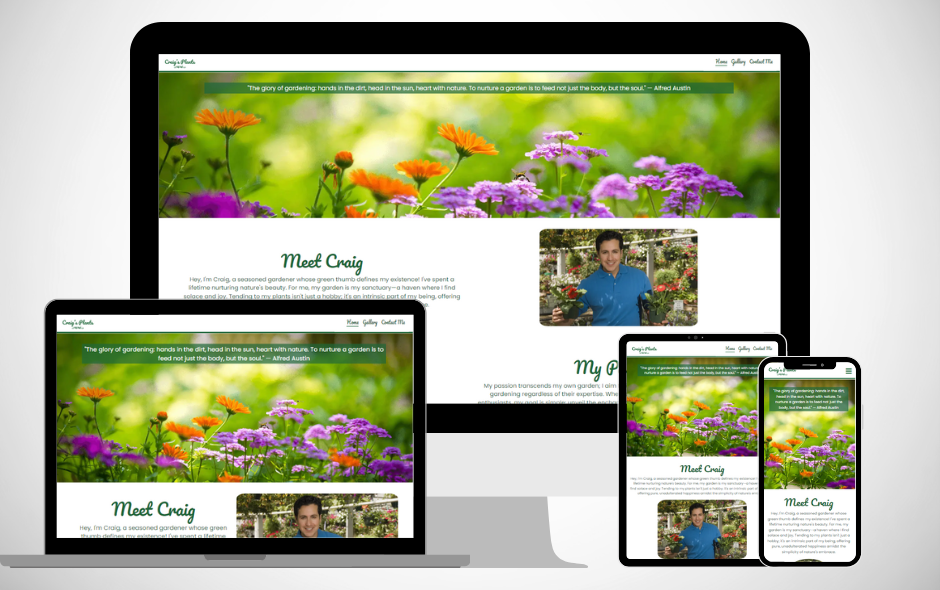
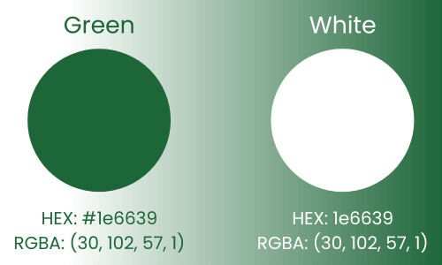

# Craig's Plants

Craig's Plants is a website aimed at helping fellow gardeners get the most out of their garden. Craig has a wealth of knowledge and is happy to help those who need a bit of inspiration or advice. The website aims to inspire by showcasing some of the different gardens that Craig has worked on, as well as being a friendly touchpoint for beginners or experienced gardeners to get friendly advice. View the live site [here](https://craigs119.github.io/Craigs-Plants-P1/).

GitHub Profile: <https://github.com/CraigS119/Craigs-Plants-P1> 
 
Deployed Site: <https://craigs119.github.io/Craigs-Plants-P1/contact-me.html>

## Table of contents

- Item 1
- Item 2
- Item 3

## User Experience

### Goal of the website

To inspire and educate both beginner and intermediate gardeners about their gardens. It will aim to provide users with various horticultural examples, visuals and advice, to illustrate the potential of their gardens.

#### Key information for the site

- Who is Craig and why is he trustworthy.
- Benefits of gardening.
- Inspiration to begin a gardening project.
- Examples of renowned gardens in ireland.
- Contact form for advice.

### User Stories

#### General User Goals

- As a general user, I want to clearly understand the purpose of the website to be clear.
- As a general user, I want to navigate the website easily.
- As a general user, I want to the website to format on different devices that I use.
- As a general user, I want to interact with the website to enhance the experience.

#### First Time users

- As a First Time Visitor, I want to easily learn about Craig and his expertise.
- As a First Time Visitor, I want to learn about some of the benefits of gardening.
- As a First Time Visitor, I want to be inspired to take up gardening and increase my horticulture knowledge.

#### Returning Visitor Goals

- As a returning Time Visitor, I want to visit some of Craig's social platforms to view other content.
- As a returning Time Visitor, I want to learn about some of the projects that Craig has been involved in.
- As a returning Time Visitor, I want to view some of the best gardens in Ireland for ideas and inspiration.

#### Frequent User Goals

- As a frequent user, I want to contact Craig for advice on my own project.
- As a frequent user, I want to check if any new content or projects have been added.
- As a frequent user, I want to research gardens in Ireland that I may visit.

#### Site Owner Goals

- As a site owner, I want to ensure the website is up to date and accurate.
- As a site owner, I want to to ensure the website can be viewed in various devices.
- As a site owner, I want to ensure the website's purpose and goals are clear.
- As a site owner, I want to ensure the website performs well and all code is validated.
- As a site owner, I want to locate and fix any bugs that may arise.

### Design

#### Color Scheme

The color scheme chosen for this website consists of green (#1e6639) and white (#ffffff). The color green is naturally associated with plants, gardens, and positive functions such as productivity and work. A darker shade was specifically chosen to create a strong contrast with the white background. This color scheme complements images of gardens and plants, providing users with a sense of horticulture when navigating the website

#### Typography

The font used in the logo and all headings is Pacifico. This choice was made due to its handwritten style, which imparts a personal feel to the site, adding a touch of elegance rather than merely presenting information. The text font is Poppins, selected for its clarity and legibility, ensuring users can easily read paragraph text. In case the custom fonts fail to load, a fallback font of sans-serif was implemented.

#### Imagery

The images featured on the Homepage were sourced from Canva's stock images.
For the Gallery section, images were obtained from various websites, including [Discover Ireland](https://www.discoverireland.ie/guides/summer-gardens-ireland), [Love to visit Ireland](https://lovetovisitireland.com/blarney-castle-visitors-guide-updated-2023/), [TripAdvisor](https://www.tripadvisor.ie/Attractions-g186591-Activities-c57-t58-Ireland.html), and [The Independent](https://www.independent.ie/life/travel/ireland/top-10-irish-gardens-shane-fitzsimons-and-norrie-lalors-picks-to-put-a-spring-in-your-step/40269497.html).

The background image for the Contact Me section was also sourced from Canva's stock.

<!--  Design -->
Colour scheme
Typography
Imagery
Wireframes

<!-- Features -->
General features of each page
Future implementations
Accessibility

<!--  Technologies Used -->
Languages used
Frameworks, libraries and programs used

<!-- Deployment and Local Development -->
Deployment instructions
Local development - how to fork
Local development - how to clone

<!-- Testing -->
Automated testing:
W3c validator
  Lighthouse
Manual testing
  Testing user stories
  Full testing
Bugs
  Known bugs
  Solved bugs

<!-- Credits -->
Code used
Content
Media
Acknowledgements
