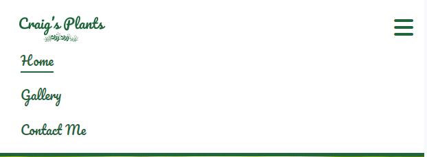
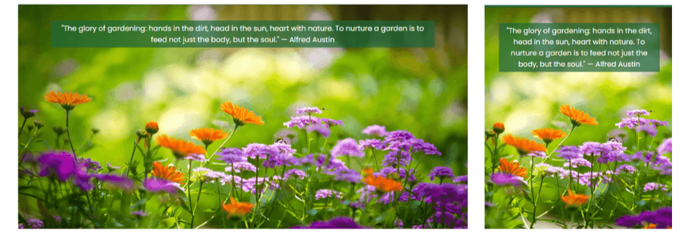
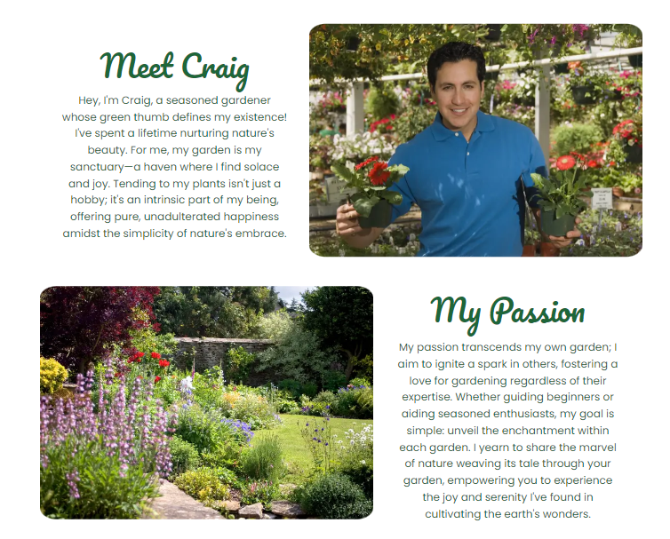
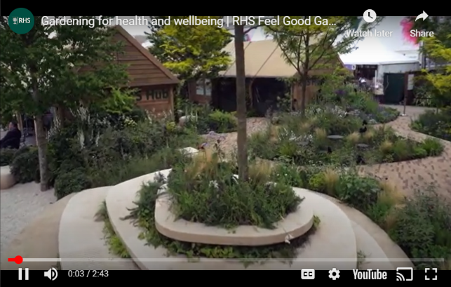
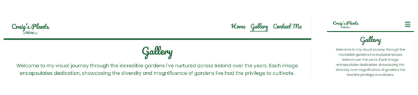
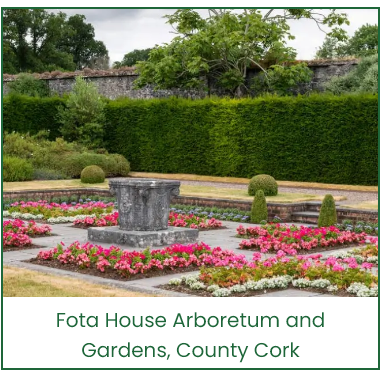
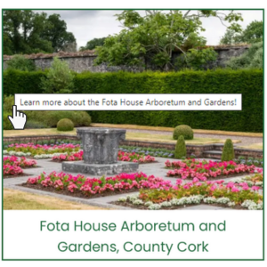
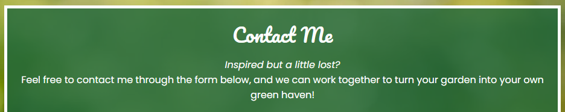

# Craig's Plants

Craig's Plants is a website aimed at helping fellow gardeners get the most out of their garden. Craig has a wealth of knowledge and is happy to help those who need a bit of inspiration or advice. The website aims to inspire by showcasing some of the different gardens that Craig has worked on, as well as being a friendly touchpoint for beginners or experienced gardeners to get friendly advice. View the live site [here](https://craigs119.github.io/Craigs-Plants-P1/).

GitHub Profile: <https://github.com/CraigS119/Craigs-Plants-P1> 
 
Deployed Site: <https://craigs119.github.io/Craigs-Plants-P1/contact-me.html>

## Table of contents

- Item 1
- Item 2
- Item 3

## User Experience

### Goal of the website

To inspire and educate both beginner and intermediate gardeners about their gardens. It will aim to provide users with various horticultural examples, visuals and advice, to illustrate the potential of their gardens.

#### Key information for the site

- Who is Craig and why is he trustworthy.
- Benefits of gardening.
- Inspiration to begin a gardening project.
- Examples of renowned gardens in ireland.
- Contact form for advice.

### User Stories

#### General User Goals

- As a general user, I want to clearly understand the purpose of the website to be clear.
- As a general user, I want to navigate the website easily.
- As a general user, I want to the website to format on different devices that I use.
- As a general user, I want to interact with the website to enhance the experience.

#### First Time users

- As a First Time Visitor, I want to easily learn about Craig and his expertise.
- As a First Time Visitor, I want to learn about some of the benefits of gardening.
- As a First Time Visitor, I want to be inspired to take up gardening and increase my horticulture knowledge.

#### Returning Visitor Goals

- As a returning Time Visitor, I want to visit some of Craig's social platforms to view other content.
- As a returning Time Visitor, I want to learn about some of the projects that Craig has been involved in.
- As a returning Time Visitor, I want to view some of the best gardens in Ireland for ideas and inspiration.

#### Frequent User Goals

- As a frequent user, I want to contact Craig for advice on my own project.
- As a frequent user, I want to check if any new content or projects have been added.
- As a frequent user, I want to research gardens in Ireland that I may visit.

#### Site Owner Goals

- As a site owner, I want to ensure the website is up to date and accurate.
- As a site owner, I want to to ensure the website can be viewed in various devices.
- As a site owner, I want to ensure the website's purpose and goals are clear.
- As a site owner, I want to ensure the website performs well and all code is validated.
- As a site owner, I want to locate and fix any bugs that may arise.

### Design

#### Color Scheme

The color scheme chosen for this website consists of green (#1e6639) and white (#ffffff). The color green is naturally associated with plants, gardens, and positive functions such as productivity and work. A darker shade was specifically chosen to create a strong contrast with the white background. This color scheme complements images of gardens and plants, providing users with a sense of horticulture when navigating the website

#### Typography

The font used in the logo and all headings is Pacifico. This choice was made due to its handwritten style, which imparts a personal feel to the site, adding a touch of elegance rather than merely presenting information. The text font is Poppins, selected for its clarity and legibility, ensuring users can easily read paragraph text. In case the custom fonts fail to load, a fallback font of sans-serif was implemented.

#### Imagery

The images featured on the Homepage were sourced from Canva's stock images.
For the Gallery section, images were obtained from various websites, including [Discover Ireland](https://www.discoverireland.ie/guides/summer-gardens-ireland), [Love to visit Ireland](https://lovetovisitireland.com/blarney-castle-visitors-guide-updated-2023/), [TripAdvisor](https://www.tripadvisor.ie/Attractions-g186591-Activities-c57-t58-Ireland.html), and [The Independent](https://www.independent.ie/life/travel/ireland/top-10-irish-gardens-shane-fitzsimons-and-norrie-lalors-picks-to-put-a-spring-in-your-step/40269497.html).
The background image for the Contact Me section was also sourced from Canva's stock.

#### Wireframe

A general wireframe created on Canva was used in order to identify the look and feel of the site. It helped identify colour schemes, content and gave a guideline to follow throughout the development process. Although the design changed slightly throughout the creation proces, the general style remained the same. 

- [Wireframe used to create the homepage](read-me/wireframes/wireframe-home.png)
- [Wireframe used to create the gallery page](read-me/wireframes/wireframe-gallery.png)
- [Wireframe used to create the contact me page](read-me/wireframes/wireframe-contact.png)

## Features

### Navigation Bar

- The website's navigation bar is responsive, featuring a logo on the left and three anchor elements on the right. These anchors provide quick access to different pages on the website, such as the home page, the gallery page, and the contact me page. The navigation elements remain consistent across all pages, ensuring a seamless user experience.

- The user can easily identify where they are on the site by a line underneath the active page on the navigation bar.
  

- A hover effect was also incorporated to the navigation bar when the cursor hovers over the elements. A line will appear underneath the element and dissapear when moved off to indictae that this link is clickable.

- On devices with a screen size of less than 768px, most commonly on screens smaller than a tablet, the navigation menu rsponds by using the burger icon to save space and keep the integrity of the web design. This was created following the steps in the love running project.

- When the burger menu is clicked, it expands underneath the logo, then dissapears again after an option is clicked. 

### Footer
- The footer contains a title and four social media icons: Facebook, Instagram, Twitter (X) and YouTube. Each logo is clickable and will take the user to the relevant social media account.

- The title gives context to the icons and also draws attention to the icons. It acts as a type of call to action.

1[footer](read-me/media/footer-icons.png)

### Home Page

#### Hero Image

- The hero image is the first interaction the user will have with the website. The image is colourful and portrays a biodiverse garden in the summer. This image creates an emotional response by the user and indictaes impactfully what the website's purpose is.
  
- This is accompanied by cover text with a semi transparent background in the the top center of the hero image. The cover text consists of a qoute by Alfred Austin speaking of the joy of working in the garden. This qoute was sourced from [BrainyQoutes.com](https://www.brainyquote.com/quotes/alfred_austin_169801).

- Both the hero image and the cover text are fully responsive and adapt to various screen sizes.

#### Meet Craig

- The meet Craig consists of text and an image.The text gives an introduction to who Craig is and the image shows a visual as to what Craig looks like.

- Both the text and the image are responsive and change layout depending on device. The image has an extra point of responsiveness as the border radius changes depending on screen size.

- Both the hero image and the cover text are fully responsive and adapt to various screen sizes.
  - [Meet Craig section on mobile](read-me/media/home-page/meet-craig-mobile.png)
  - [Meet Craig section on tablet](read-me/media/home-page/meet-craig-tablet.png)
  - [Meet Craig section on laptop](read-me/media/home-page/meet-craig-laptop.png)

#### My Passion

- The My passion Section also consists of text and image, similar to Meet Craig. The text aims to explains Craig's motivation and what he intends to acheive through the website. The image shows a garden in full bloom, aiming to create a visual of what a garden could could look like. The image of the garden is from canva stock photos.

- The responsivness of this section follows a similar pattern to that of Meet Craig, however on larger screen, the order is reversed where the image is first and text second.
  - [My Passion section on mobile](read-me/media/home-page/my-passion-mobile.png)
  - [My Passion section on tablet](read-me/media/home-page/my-passion-tablet.png)
  - [My Passion section on laptop](read-me/media/home-page/my-passion-laptop.png)

- This creates a nice design as the two section reflect each other on larger screens.

#### Benefits of Gardening

- The benefits of gardening section consists of text and a video from YouTube. The text portrays that Craig was involved in a project that aimed at promoting mental health through gardening, and the video acts as social proof to the benefits of such a project. 

- The video offers the user full control with the ability to play, stop and all other controls associated with youTube videos. The link to the video on YouTube can be found [here](https://youtu.be/xC1hmFqC6e0?si=3zIAxWMuRDx2YRbI).

- Both the text and video are responsive in size and adapt accordingly to screen size.
  - [Benefits of Gardening section on mobile](read-me/media/home-page/benefits-mobile.png)
  - [Benefits of Gardening section on tablet](read-me/media/home-page/benefits-tablet.png)
  - [Benefits of Gardening section on laptop](read-me/media/home-page/benefits-laptop.png)

### Gallery Page

- The gallery page contains all header and footer mentioned in this document.

- The Gallery has a ttitle and an introduction text above the images. This is to give context to the user as to what the images are. The text is also fully responsive.

- The gallery consists of 16 sections, each consisting of one image and text underneath. The gallery portrays different gardens that Craig has worked on in Ireland. The page is fully responsive, adapting its rows and columns depending on screen size. 
  - [Gallery page on mobile](read-me/media/gallery-page/gallery-mobile.png)
  - [Gallery page on tablet](read-me/media/gallery-page/gallery-tablet.png)
  - [Gallery page on laptop](read-me/media/gallery-page/gallery-laptop.png)

#### Gallery Image

- Each gallery is downloadable by the user. each image is also accompanied by text underneath giving the name and location of the garden they are viewing.

- Each image is clickable and will bring the user to an external website relating to the garden where the user can find out more information.

### Contact me Page

- The contact me page is aimed at taking the user into the real world and creating offline engagement. The form is fully responsive and adapts to various screen sizes. The page has a background image of a blurred out garden in order to create a feel of a garden without seeing it. 
  - [Contact Me page on mobile](read-me/media/contact-page/contact-me-mobile.png)
  - [Contact Me page on tablet](read-me/media/contact-page/contact-me-tablet.png)
  - [Contact Me page on laptop](read-me/media/contact-page/contact-me-laptop.png)

- The contact me has an introductory title and text, aimed and offering a friendly tone and what the user can contact Craig about.

- The contact form consists of inputs such as first name, last name, email address, gardening knowledge and message.
  - The gardening knowledge is expressed through a slider in order to allow the user to not have to put too much thought and worry they may over exagerate their knowledge. The user can move the slider based on their own judgement between one and ten.

### Features to implement in the future

- Blogs can be added to the page in order to make it more educational. This would provide added value as well as help with SEO
- A subscribe page to a newsletter could be created in order to communicate with frequent users of the site.
- A FAQ page could be implemented in order to readily address beginner gardener's common questions.
- An events section could be incorporated to let users know of what gardening events are occuring nearby or what projects |Craig has planned or involved in.

<!-- Features -->
General features of each page
Future implementations
Accessibility

<!--  Technologies Used -->
Languages used
Frameworks, libraries and programs used

<!-- Deployment and Local Development -->
Deployment instructions
Local development - how to fork
Local development - how to clone

<!-- Testing -->
Automated testing:
W3c validator
  Lighthouse
Manual testing
  Testing user stories
  Full testing
Bugs
  Known bugs
  Solved bugs

<!-- Credits -->
Code used
Content
Media
Acknowledgements
